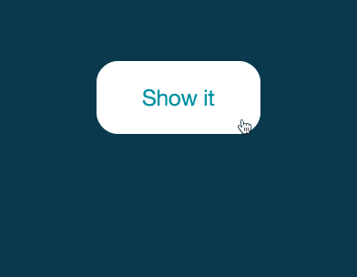

# Transitions and JavaScript

到目前为止，前面我们举过的例子，都是使用 CSS 中的 `transition` 在鼠标悬停时和不悬停时添加过渡效果。

这些效果都需要被动地触发，就是要鼠标悬停在元素上或者从元素上移开。当然这不是触发这些效果的唯一方式，我们还可以使用 `JavaScript` 代码来触发这些效果。

## Add or remove classes

`transition` 的作用就是在两个状态之间创建平滑的变化效果，不至于显得太突兀。既然是两个状态，那我们可以把这两个状态用不同的 `class` 来对应，然后通过 `javascript` 来控制添加和删除这些 `class`，从而触发效果。

看下面的例子，具体代码可见[CodePen](http://codepen.io/donovanh/pen/YPbxqa)。



```html
<button id="show-element">Show it</button>
<div id="to-show" class="hide">
  <h1>Some hidden content</h1>
  <p>Pressing the button shows this content. Nice!</p>
</div>
```

在这个例子中，页面结构主要有一个 `button` 和一个 `div` 容器。

```css
.hide {
  opacity: 0;
  top: calc(50% + 8em);
}
.show {
  opacity: 1;
  top: calc(50% + 6em);
}
```

初始时给容器添加了一个类名是 `hide`，设置其 `opacity` 为0，视觉上就不显示了。样式表里还有要给 `show`，设置 `opacity` 为1，为可见状态。

更复杂的例子可以看这篇文章[Adding Appeal to Your Animations on the Web](http://webdesign.tutsplus.com/tutorials/adding-appeal-to-your-animations-on-the-web--cms-23649)。

在本教程的末尾我们还会学习怎么在滚动时触发 `transition` 和 `animation` 来改变样式。

## Controlling transitions with JavaScript

除了像上面那样给元素添加或者移除 CSS 类名，我们还可以像下面这样直接用 `javascript` 修改 CSS 属性。

```javascript
    element.style.transition = 'opacity 1s ease-out';
```

实际应用里，假设我们有个 ID 是 `js-show` 的元素，我们可以这样设置：

```javascript
    document.getElementById('js-show').style.transition = 'opacity 1s ease-out';
```

值得注意的是，如果采用上述方式去设置 `transition`，那要带上**浏览器前缀**:

```javascript
    document.getElementById('js-show').style.webkitTransition = 'opacity 1s ease-out';
    document.getElementById('js-show').style.transition = 'opacity 1s ease-out';
```

## Let's recap

这一章我们系统地介绍了 `transition`，包括它的几个属性分值（`duration`,`delay`,`timing function`），还介绍了如何组合使用多个 `transition` 来创造复杂的效果，最后我们还尝试了用 `javascript` 直接控制 `transition`。

下一章我们将讨论 `animation` 这个话题。

## Homework

Before we start looking at the `animation` property, take some time to think about how you use transitions.

Can you think of ways they could help smooth the interactions or state changes on your pages? How might they add appeal?