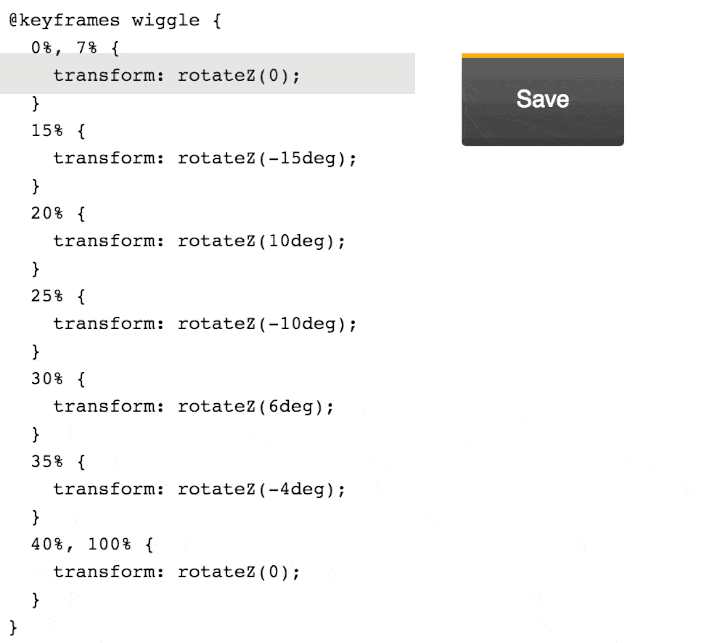

# Keyframes in action

前面章节我们学习了 `animation` 属性，并且初步了解了 `keyframes`。这一节我们来深入学习下 `keyframes`。

## Things to look out for

下面是一个简写方式，只有两个状态，初始状态和终止状态，与 0% 和 100% 的写法是等价的。

```css
    @keyframes name {
      from {
        ...
      }
      to {
        ...
      }
    }
```

有时候我们会像下面这样，在一行内写好几个百分比数值，这类似一个暂停的效果。下面的 `0%, 20%` 的意思是，在 `0%` 的时候，元素的 `opacity` 的值为0，然后保持这个“状态”直到 `20%`，然后 `opacity` 开始改变，并在 `100%` 的时候变为1。后面我们会用到这个知识点。

```css
    @keyframes name {
      0%, 20% {
        opacity: 0;
      }
      100% {
        opacity: 1;
      }
    }
```

## Example: Save button wiggle effect

还记得之前讲过的"Save"按钮吗？我们再重新回顾一下：


在开始添加 `animation` 之前，我先在页面上添加了一个按钮，然后设置了它的基本样式，让它看起来像 `CodePen` 的按钮。在这里我用了绝对定位让它显示在屏幕的中间。

然后我给按钮添加了 `animation`：将添加名为 "wiggle" 的 keyframes，持续2s时间，时间函数用 `linear`。

```css
    button {
      animation: wiggle 2s linear infinite;
    }
```

最后的 `infinite` 是新属性，它是 `animation-iteration-count` 的一个可选值。我们可以通过设置 `animation-iteration-count` 让动画效果重复我们想要的次数，默认是1次。这里设置为 `infinite` 表示动画将一直重复。

来看下 `keyframes` 的完整代码：

```css
    @keyframes wiggle {
      0%, 7% {
        transform: rotateZ(0);
      }
      15% {
        transform: rotateZ(-15deg);
      }
      20% {
        transform: rotateZ(10deg);
      }
      25% {
        transform: rotateZ(-10deg);
      }
      30% {
        transform: rotateZ(6deg);
      }
      35% {
        transform: rotateZ(-4deg);
      }
      40%, 100% {
        transform: rotateZ(0);
      }
    }
```

在上面的代码里我们设置了一系列的关键点(`waypoint`)，在每一个点都将按钮绕z轴(z-axis)旋转一定角度。

具体怎么旋转和变化的我们看下面的动图，我们发现浏览器自动完成了每个关键帧之间的插值。



[CodePen链接](http://codepen.io/donovanh/pen/KwEQdQ)

## Homework

看下面的例子：[a new CodePen with a single animated element](http://codepen.io/donovanh/pen/azgjMz?editors=010)。该例子综合使用了 `animation` 里的 "animation-timing-function" 和 "keyframes"。

尝试删掉几个 frame，或者修改下百分比的数值，看看会有什么效果。
