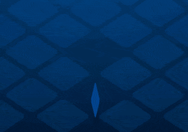
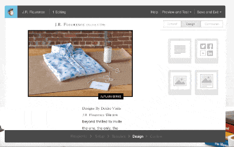
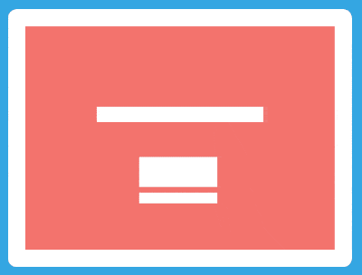
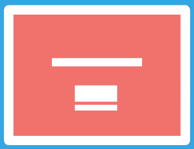

# Storytelling

现在我们已经介绍了`transition`和`animation`属性，让我们将它们组合成一个具有悬停效果的动画。

## Heroes

许多网站都喜欢在主页顶部使用一个引人注目的大图像。有时称为“hero image”，通常是横向大图样式。

我最近发现的一个很好的例子是Fabric登陆页面。CSS animatiom显示了Fabric如何为模块化框架工作。

另一个有趣的例子是Mailchimp主页。在这里，hero image讲述了如何创建电子邮件的故事。

您可能还在[my CSS Animation 101 email course](https://cssanimation.rocks/courses/animation-101/)登录页面上看到了它：

在以上示例中，他们都使用动画来设置页面的色调并说明网站的内容。

## Example: Scrolling background

让我们创建一个例子。在这个例子中，我创建了一个在网页上下移动的“web page”样式图形。

对于一些交互、动画暂停、鼠标悬停在屏幕上时显示消息等都是利用animations和transitions来实现的。

[See it in action here](http://codepen.io/donovanh/pen/LEwedW?editors=110)。

## Part 1: Background  animation

要设置此示例，我们从HTML元素开始：

    

我们可以使用某些样式使“screen”div看起来像显示器或iPad：

    .screen {
      background: #e25865 url(//cssanimation.rocks/screen/images/screen_bg.png) no-repeat top center;
      background-size: 100% auto;
      border: 2em solid #fff;
      border-radius: 1em;
      width: 40em;
      height: 30em;
    }

我们有一些定义大小和边框的样式，以及[setting a background image](https://cssanimation.rocks/screen/images/screen_bg.png)。

我们创建的效果基于移动背景图像。背景图像比屏幕高，并且`background-size`设置为`100% auto`。这意味着背景将自适应容器的宽度并能同比例调整高度。

增加背景图像的动画处理，我们现在可以编写`keyframes`，使其看起来像某人正在滚动网页：

    @keyframes scroll {
      0%, 10% {
        background-position: 0 0;
      }
      20%, 30% {
        background-position: 0 -22em;
      }
      50%, 60% {
        background-position: 0 -44em;
      }
      90%, 100% {
        background-position: 0 0;
      }
    }

这里设置动画的属性是`background-position`。有了这个属性，我们可以上下移动它。它从`0 0`开始，这意味着从左上角开始。

在接下来的帧中，我们将背景移动22 ems，然后是44 ems，然后返回到页面顶部。让我们创建一个动画属性，将其应用于“screen”元素。

    .screen {
      animation: scroll 5s infinite cubic-bezier(.52,-0.39,.3,1.43);
    }

这个CSS应用了一组名为“scroll”的关键帧，动画时长5秒，循环播放并使用`cubic-bezier`计时功能。在这种情况下，立方贝塞尔函数给动画增加了弹性效果，没有它，运动看起来就不那么逼真了。

我在[cubic-bezier.com](http://cubic-bezier.com/#.52,-0.39,.3,1.43)上创建了这个bezier。如果您尚未为该网站添加书签，我强烈建议您加上！

## Part 2: Adding the hover transition

在动画结束后或者希望人们专注于其他动画时最好暂停或停止动画。循环播放的动画可能会分散注意力，所以我们可以使用`animation-play-state`属性在悬停时暂停动画。

    .screen:hover {
      animation-play-state: paused;
    }

上述代码表示当光标悬停在动画上时，它将暂停。当光标再次移开时，它将恢复其默认的`playing`状态。

您也可以使用JavaScript实现此目的。一种可能性是当用户与页面的另一部分交互时，或者当它们滚动时，让一些JavaScript禁用动画。我们将看一下如何在以后滚动时启用动画。

### Adding a message

当用户将鼠标悬停在元素上时，我们可以使用transition来显示消息。要做到这一点，我们需要更多的HTML：

    

      
Hover message!

    

在[the CodePen CSS](http://codepen.io/donovanh/pen/LEwedW?editors=110)中，我们将此消息放在“screen”的中并使其不可见。

    .message {
      /*... positioning styles ...*/
      opacity: 0;
      transition: all 0.4s ease-out;
    }

然后我们可以使用`transition`在悬停时显示它：

    .screen:hover .message {
      opacity: 1;
    }

由于我们在“message”样式上设置了`transition`，因此当光标悬停在元素上和离开时，它都会创建动画。暂停的动画和过渡效果如下所示：

## Summary

在本章中，我们将animation和transition组合在一起，创建了用于登录页面和产品导览的效果。我们利用`animation-play-state`来确保动画在我们想要时停止。

## Homework

花一点时间思考我们到目前为止所涵盖的内容。

我们讲述了很多。结合animation和transition是将页面变为现实的有效方式。

在考虑如何将其应用于您的工作时，请考虑如何控制它。什么时候动画可以为您的用户带来好处，什么时候可以起作用呢？很高兴知道如何制作动画，但更好的是知道什么时候不使用动画。