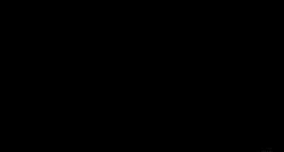
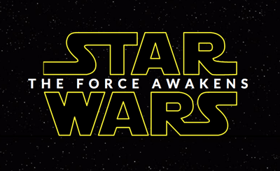
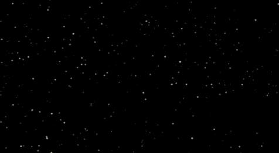

# Star Wars

可乐爆米花准备好了么！在这章中我们要做一个有意思的 SVG 动画。我们将在 “The Force Awakens”（《星球大战7:原力觉醒》）电影预告片中制作 “Star Wars” 的片名。。

这个例子是将 CSS 动画与其他一些 CSS 属性相结合后呈现的，特别是 `transforms`、`scale`、`translate` 和 `rotate`。

## Transform: Not an animation property

虽然听起来它可能会创建动画，但 transform 属性实际上对元素进行旋转、缩放、移动或倾斜。我们可以使用它来创建出色的效果但是为了做到这一点，我们需要对每个关键帧或动画状态进行不同的变换。

## Transform: scale(), translateZ() and rotateY()

我们可以使用 `scale` 来控制元素缩放。使用 `translateZ`，我们可以在 Z 轴上移动元素。Z 轴就是从你到屏幕画一条线来表示的轴。

在这种情况下，我们将使用 scale 和 translateZ 的组合使其看起来像一些单词在太空中飞行。

最后，我们将使用 `rotateY` 来旋转标语的字母。围绕 Y 轴旋转将需要在浏览器中进行一些 3D 工作。

## SVG，HTML和CSS

为了准备这个例子，我为徽标 [Star](https://cssanimation.rocks/demo/starwars/images/star.svg) 和 [Wars](https://cssanimation.rocks/demo/starwars/images/wars.svg) 制作了两个 SVG 文件。如果你想试试，可随意使用。

演示的 HTML 如下：

    

      
      
      <h2 class="byline" id="byline">The Force Awakens</h2>
    

静态图像 [of some stars](https://cssanimation.rocks/demo/starwars/images/bg.jpg) 用于背景。副标题中的字体很难找到，所以我在本例中引用了 Web 字体 “Lato”。

通过一些绝对定位将内容定位在屏幕中间，我们从这开始：

## Animating the Star and Wars

我们希望较大的文本淡入视野，同时随着时间推移开始变大后变小。这是 `scale（）`变换的一个很好的例子。让我们在 “Star” 这个词上使用以下关键帧：

    @keyframes star {
      0% {
        opacity: 0;
        transform: scale(1.5) translateY(-0.75em);
      }
      20% {
        opacity: 1;
      }
      89% {
        opacity: 1;
        transform: scale(1);
      }
      100% {
        opacity: 0;
        transform: translateZ(-1000em);
      }
    }

在此动画过程中有两个属性会发生变化。`opacity` 和 `transform`。opacity 属性使其开始透明，并在最后逐渐消失，以便我们可以循环动画。

通过将 scale 设置为`1.5`倍大小。这意味着文本的初始大小比正常大150％。在89％时，我们将 transform 的 scale 属性设置为1。这意味着在0％和89％之间，比例从150％到100％。

最后的 `transformZ` 使单词快速缩小。

我们可以将这些关键帧应用于单词 “Star”，如下所示：

    .star {
      animation: star 10s ease-out infinite;
    }

同样，“Wars” 一词也是这样处理。

## Making it 3D

在 CSS 中使用 3D 变换，无论是沿 Z 轴平移，还是围绕 Y 轴和 Z 轴旋转，都需要为 3D 设置一个平台。在 HTML 术语中，这意味着我们创建一个容器，并告诉浏览器将发生一些 3D 效果。

我们通过在 `.starwars-demo` 容器中添加以下内容来实现：

    .starwars-demo {
      perspective: 800px;
      transform-style: preserve3d;
    }

这两个属性告诉浏览器指定子元素定位在三维空间内，而不是平面。[CSS Tricks](https://css-tricks.com/almanac/properties/t/transform-style/) 详细介绍了该属性。

其次，`persective` 属性告诉浏览器场景需要 “deep”（深度）。以防万一我们将深度定为`800px`。由于场景较短，较小的值会产生更多 “extreme”(极端)的透视效果。

有了这个，我们开始介绍标语。

## The Force Awakens

标语 “The Force Awakens” 出现在预告片中，每个字母都旋转到位。我们可以使用 `rotateY` 变换创建这个效果。在这种情况下，我们将每个字母包裹在 `span` 元素中，以便我们可以将动画应用于每个字母。

我很快发现的一个问题是，没有一种简单的方法来为副标题中的每个字母设置动画。我的第一种方法是手动将每个字母包装在 `span` 标签中。这有效，但使 HTML 有点混乱。当前的演示包括一些 JavaScript（感谢[Tady](https://twitter.com/tadywankenobi)的帮助），它将每个字母自动包装在 `span` 中。

我们将为每个字母应用动画。

首先，关键帧：

    @keyframes spin-letters {
      0%, 10% {
        opacity: 0;
        transform: rotateY(90deg);
      }
      30% {
        opacity: 1;
      }
      70%, 86% {
        transform: rotateY(0);
        opacity: 1;
      }
      95%, 100% {
        opacity: 0;
      }
    }

首先，字母旋转90度，然后动画旋转70％转为0度，即字母转为面向观众。

我们可以将这组关键帧应用于每个span，如下所示：

    .byline span {
      animation: spin-letters 10s linear infinite;
    }

结果是，每个字母的每个 “span” 容器都会逐渐淡入并慢慢旋转到位，然后在动画结束时逐渐消失。

把它放在一起就是 [finished demo](http://codepen.io/donovanh/pen/pJzwEw?editors=110)。

## Homework

如果你有时间我会鼓励你看一下 [CodePen version](http://codepen.io/donovanh/pen/pJzwEw?editors=110)。

你可能会注意到 CSS 中的一些 “media” 查询。我们使用 “media” 来调整适应较小的设备。尝试更改一些动画关键帧，或 `transform` 值来查看会发生什么。